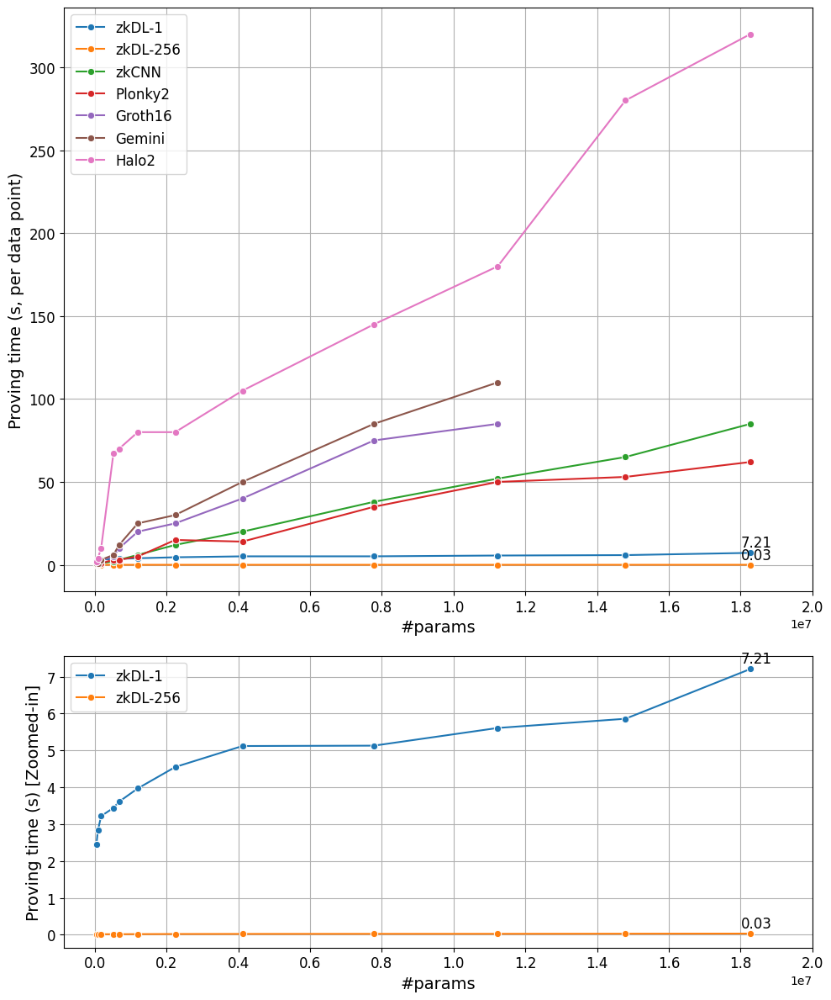

# zkDL: A Zero-knowledge Proof Backend for Deep Learning on CUDA, Like No Other

**zkDL** isn't your typical zero-knowledge proof backend. It's specially designed for deep learning on CUDA. While many ZKP frameworks generalize for machine learning, zkDL dives deep, preserving tensor structures and leveraging CUDA's might for optimized proof generation.

---

## Dive In: A Quick Introduction

When you think of zero-knowledge proofs (ZKP) integrating with deep learning, think **zkDL**. It stands out, not just for its unique focus on tensor structures but also its superb speed, all thanks to CUDA's parallel processing chops.

## Let's Get Technical

Here's a breakdown:

1. **Foundation**: We've hitched our wagon to the CUDA implementation of the `bls12-381` elliptic curve, borrowing from Filecoin's `ec-gpu` package. This is our building block.
   
2. **Deep Dive into Quantization**: To make ZKP tools tick, we've quantized the floating-point numbers in deep learning ops.
    
3. **Tensor Magic with GKR**: Our specialized spin on the GKR protocol (a popular ZKP protocol) keeps those tensor structures intact, opening the doors to parallel proofing. And for the pesky non-arithmetic ops (like ReLU) that don't play nice with ZKP? We cleverly use *auxiliary inputs* (think bit representations) to turn them arithmetic.
    
4. **Neural Networking, the zkDL Way**: While it's tempting to mirror the neural network in an arithmetic circuit, we've got a workaround. The bugbear of non-arithmetic ops threw a spanner in the works. But, plot twist! Instead of sticking to layer precedence, we can flatten the neural network into a *flat* circuit when non-arithmetic ops come into play. The result? A proof for all layers that we can run in one go! 


## Before You Begin

Got CUDA? Check. Make sure it's installed and do a compatibility check, perhaps with `sm_70` as a reference.

## Set Up & Go!

1. First off, adjust the architecture with NVCC_FLAGS in your `Makefile`.

```cmake
# NVCC compiler flags
NVCC_FLAGS := -arch=sm_70
```

2. Now, gear up to compile the demo. Don't fret if it takes a minute (or a few).

```bash
make demo
```

## Give the Demo a Whirl

Here's how:

```bash
# ./demo num_layer log_width log_batch_size
./demo 8 10 6 
```

For the curious, this example dives into inference on a fully stacked neural network: 8 layers, 1024 neurons each layer, batch size 64. And voila, in just a few seconds, you're done!

## The zkDL Speedometer

Taking cues from [ModulusLabs' benchmark](https://medium.com/@ModulusLabs/chapter-5-the-cost-of-intelligence-da26dbf93307), we put zkDL to the test with varying neural network sizes. Turns out, we're racing ahead with a whopping 100x to 1000x speed-up in proof time. We're literally off the charts!



## What's Next on Our List?

- [ ] Dive deeper into diverse deep learning architectures.
- [ ] Re-imagine zero-knowledge verifiable **training**, not just **inference**. (If curious, check our research paper [zkDL: Efficient Zero-Knowledge Proofs of Deep Learning Training](https://arxiv.org/abs/2307.16273).)
- [ ] Proof compression for all deep learning layers, and let's fire up that multi-gpu version for even more speed!
- [ ] Expand on structures and their back propagations to amp up flexibility.

## A Little Heads Up!

zkDL is a work in progress and hasn't undergone a full audit yet. We suggest holding off from using it in production for now.

## Holler If You Want to Dive Deeper

Keen on contributing or just want to chat? Drop a line to the maestro behind zkDL, Haochen Sun, at haochen.sun@uwaterloo.ca.